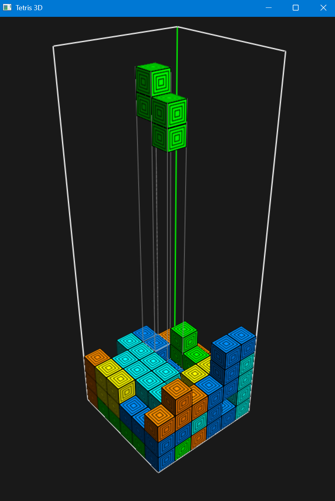
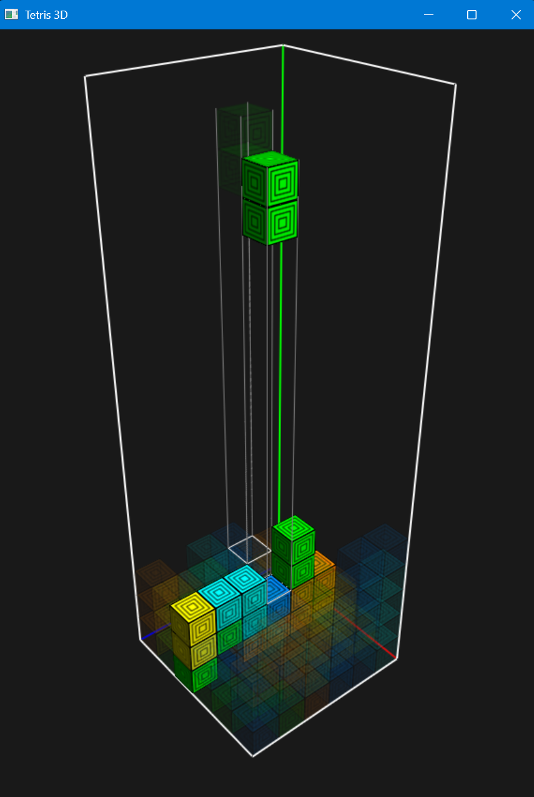

# hdu2025_graphics

Course work repository for HDU (2024-2025-2)-B0504060-05 "Computer Graphics".

## Contents

* [x] Interactive Bezier curve demo ([bezier/](bezier/))
* [x] 3D transformation demo ([transform/](transform/))
* [x] Project: Tetris 3D! ([tetris3d/](tetris3d/))

## Projects

### bezier

```sh
$ python ./bezier/bezier_interactive.py
```

* Left mouse button: Add a point to the current spline
* Middle mouse button: Finish the current spline and create another connected one
* Right mouse button: Remove last point from the current spline


*Figure 1: Screenshot for interactive Bezier curve demo.*

### transform

```sh
$ python ./transform/transform.py
```

* `x`: Toggle between object and camera edit modes
* Object mode:
  * Left mouse drag: Rotate object
  * Right mouse drag: Move object
  * Mouse wheel: Scale object up/down
  * Space: Create a new object (add current to scene)
  * Backspace: Remove last object and make it active
  * `q`: Toggle between cube and sphere
  * `r`: Reset object transforms (rotation, scale, position)
  * `1`, `2`, `3`: Flip object symmetry along x, y, z axes
  * `c`: Change to a random color
  * `a`: Toggle object axes visibility
  * `,`: Create random object and add to scene
* Camera mode:
  * Left mouse drag: Orbit camera
  * Mouse wheel: Zoom in/out
  * `p`: Switch between perspective and parallel projections
* `ESC`: Exit program


*Figure 2: Screenshot for transformation demo.*

### tetris3d

```sh
$ python ./tetris3d/tetris3d.py
```

* Gameplay controls:
  * `w`, `a`, `s`, `d`: Move piece (direction relative to camera view)
  * `q`: Rotate piece around Y axis
  * `e`: Rotate piece around Z axis
  * `SPACE`: Drop piece instantly
  * Arrow keys: Pan camera
  * Left mouse drag: Rotate camera view
  * Mouse wheel: Zoom in/out
  * `HOME`: Reset camera position
  * `m`: Toggle grid marker visibility
  * `z`: Toggle block landing locator visibility
* Pause mode (press `` ` ``):
  * `` ` ``: Resume game
  * `1`, `2`, `3`: Select along X, Y, Z axis respectively
  * Right mouse click: "X-Ray on" on a layer along the axis
  * `m`: Toggle grid marker visibility
  * `z`: Toggle landing locator visibility
* `ESC`: Exit program

!

*Figure 3: Screenshot for Tetris3D.*



*Figure 4: X-Ray mode of Tetris3D.*
